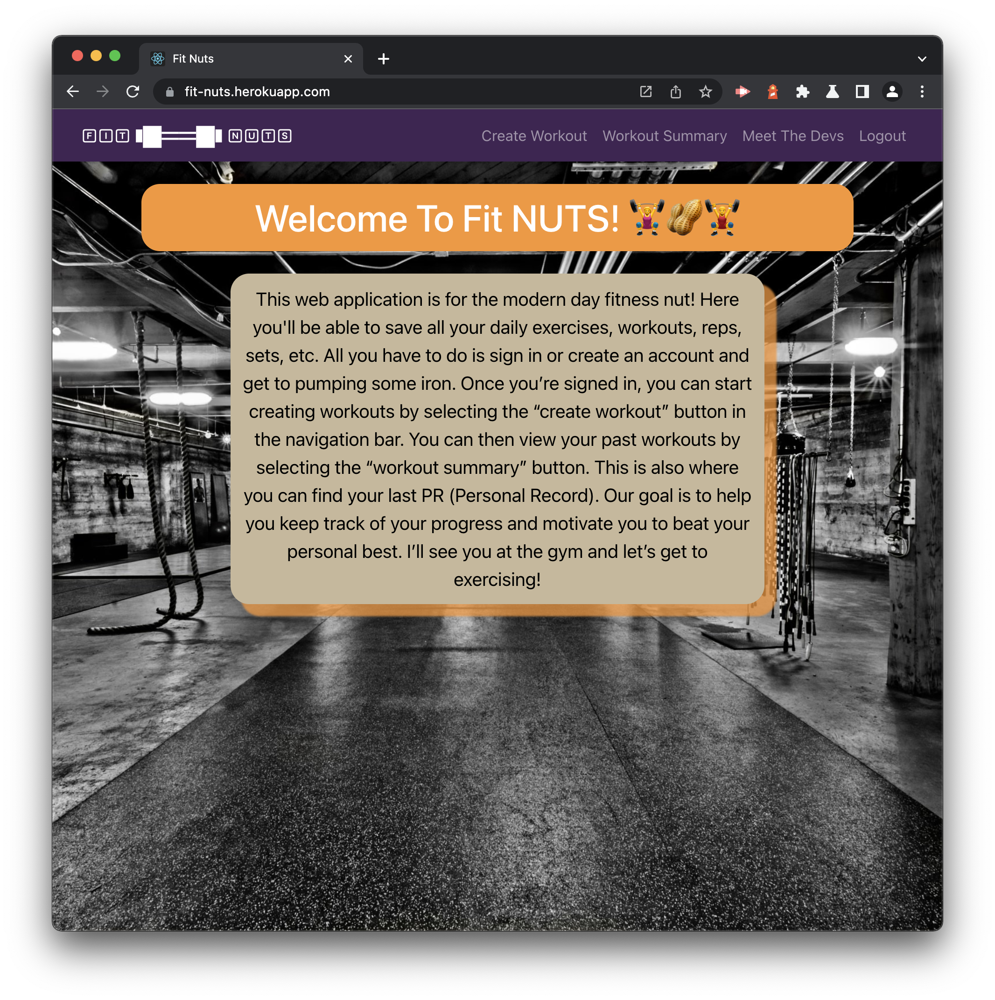
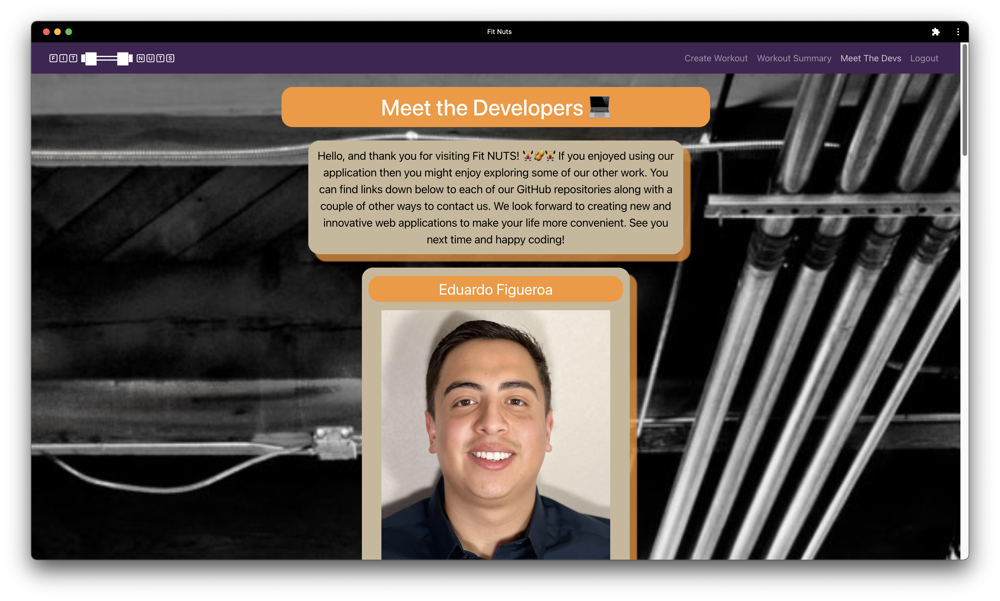

# Fit NUTS 🏋️‍♀️🥜🏋️‍♂️

 

 

## License

 

[This application is under the MIT license](https://opensource.org/licenses/MIT)

 

## Contributors

 

[Bradley Jester](https://github.com/jesterb0206) 👈 Click there to view Bradley's GitHub account!

 

[Eddie Figueroa](https://github.com/eddiefigueroa18) 👈 Click there to view Eddie's GitHub account!

 

[Pat Lubak](https://github.com/PatL8822) 👈 Click there to view Pat's GitHub account!

 

[Samuel Lee](https://github.com/samlee088) 👈 Click there to view Samuel's GitHub account!

 

[Thair Ibadi](https://github.com/Thair-i) 👈 Click there to view Thair's GitHub account!

 

## Deployment Link

 

[Deployment](https://fit-nuts.herokuapp.com)

 

👆 Click there!

 

## Table of Contents

 

- [Fit NUTS 🏋️‍♀️🥜🏋️‍♂️](#fit-nuts-️️️️)
  - [License](#license)
  - [Contributors](#contributors)
  - [Deployment Link](#deployment-link)
  - [Table of Contents](#table-of-contents)
  - [Description](#description)
  - [Installation](#installation)
  - [Usage](#usage)
  - [Badges](#badges)

<small><i><a href='http://ecotrust-canada.github.io/markdown-toc/'>Table of contents generated with markdown-toc</a></i></small>

 

## Description

 

**Fit NUTS 🏋️‍♀️🥜🏋️‍♂️** is a single-page application, built using the MERN stack, that is also a progressive web application. In addition, it features the Mongoose ODM, uses GraphQL queries and mutations for retrieving, adding, updating, and deleting data, includes JSON Web Tokens for authentication and protects sensitive API key information on the server. Users can sign up to create, modify and delete their workout routines for particular days of the week. Also, they can install **Fit NUTS 🏋️‍♀️🥜🏋️‍♂️** for offline use by navigating to the URL search bar (there will be an option to install **Fit NUTS 🏋️‍♀️🥜🏋️‍♂️** to your computer).

 

## Installation

 

Clone the repository to your local machine, open your terminal, and navigate to the root folder of the **Fit Nuts** repository. To install the necessary dependencies, run `npm i` in your command-line terminal. Repeat this process two more times, first navigating to the server folder and second navigating to the client folder (running `npm i` both times).

 

## Usage

 

1. To begin using **Fit NUTS 🏋️‍♀️🥜🏋️‍♂️**, sign up by entering a username, a valid email address and a secure password.

 

 

2. Once you sign up you'll be taken to the homepage. Here you can learn more about **Fit NUTS 🏋️‍♀️🥜🏋️‍♂️**!

 

 

3. Navigate to the `Create Workout` page to add your workout routine for a particular day of the week. Just make sure to enter what day of the week you'll be doing that exercise, it's name and the amount of weight as a numerical value or else you'll receive an error message!

 

 

4. On the `Create Workout` page you can also increase or decrease the number of sets and reps for a particular exercise and remove it all together by clicking the `Delete` button.

 

 

5. To view your workout routine for the week navigate to the `Workout Summary` page!

 

6. Finally, read more about the developers behind **Fit NUTS 🏋️‍♀️🥜🏋️‍♂️** by navigating to the `Meet the Devs` page! If you click on a developer's image you'll be taken to their portfolio. Likewise, if you click on the button with the developer's name followed by GitHub you'll be taken to that developer's GitHub account.

 

 

 

## Badges

 

 

 

 

 

 

 

 

 

 

 

 

 

 

 

 
